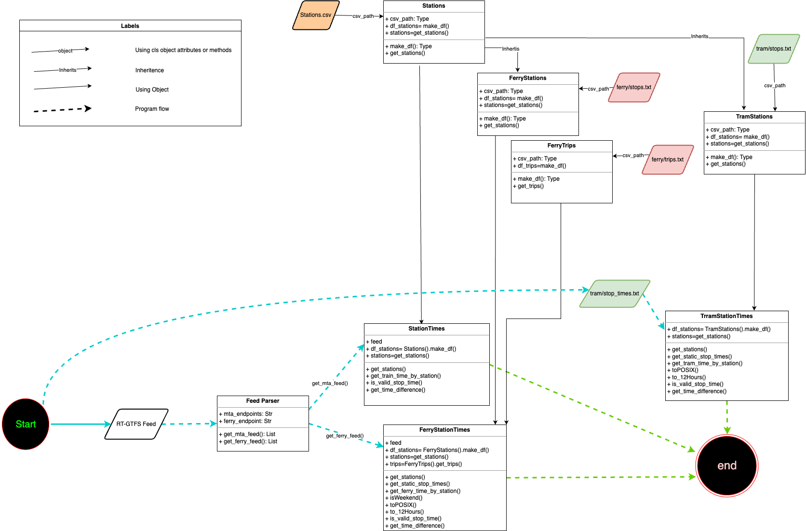

# Understanding the Code:

Below is a general representation of how the code flows from start to finish:

To get a better visual flow, refer [here](https://viewer.diagrams.net/?tags=%7B%7D&highlight=00000F&edit=_blank&layers=1&nav=1&title=CitizenProjectMTA.drawio#R7V1bl6K4Fv41rjXnQVdCuD5WVVd1zazu091TNWd6nlyoUZlCcIC6za8%2FCSRASFTKAkRLX5QICdmXL3vv7CQDdLV6%2BRy56%2BXXcIb9gQZmLwP0aaBpCOmIfNGS16wEapqVlSwib8bKioI771%2FMCgErffRmOBZuTMLQT7y1WDgNgwBPE6HMjaLwWbxtHvpiq2t3gaWCu6nry6V%2FerNkmZXaBijKb7G3WPKWIWD%2FTNzpwyIKHwPW3kBD8%2FST%2Fb1yeV3s%2FnjpzsLnUhG6HqCrKAyT7Nfq5Qr7lLicbNlzNxv%2Bzd87wkFS54Hb6xvj%2Btb1x9bFt%2FDrP%2Bv%2FPsQPQ2Swl0teOUHwjNCHXQZhQL4u015iWg8gV2GULMNFGLj%2BlzBck0JICv%2FGSfLKuOs%2BJiEpWiYrn%2F2LX7zkZ%2Bn3X7SqkcGuPr2wmtOLV34RJNHrz%2FJF6Sl6WTyWXvHnZm68TN%2BVNhYnUfiQMxblJVehH0ZpfxEAV%2BRD%2Fpn74fNF4BHGeWHAnpeJzOgeh4%2FRFG%2BhLJdlN1rgZMt9WnYfpXqpAcbCzzhcYdI5ckOEffJiT6LUukz4F%2Fl9hQCQH0wG3iAPrN4n139kLf1%2BP%2Fx8f3NHCm8wIWtVWohUr%2BlPQiLX97EfLiJ3JTJf5AHp2%2BUaRx55XxxVH%2Fxe%2FHH5vPQSfLd2Uyo%2FE%2FQRBJFW7EZTJnGQ1hpnv8FIQ9s494SjBL9spTX7d6hZTD04uEHdGrGi5wIsINeiZQkoTI3f2TiTkHlApdX201ptl9pu1ssdCt2s2mo11RbpvdJbZEmKS95%2FvErc8Zyo7S%2F%2FUUrMF3dChnOB6a7vLSgVp4RyqRpSdfHIcHnB%2Flh5s5mfyhcmCudO0vooA9ehFyRpv4zLgfFJyYWt4iwpZj7os1aEgVOpsGAEHQcJOssYWpsNrPLvtDelmitPhPN5TOSjyrb8lfbnJDc8ej0ijwBAFf0G9g4FT69KAH%2BUWm%2F3SusNebimWj%2FHUfTaf73nkt6I3gMD2oLeD9%2Bp%2BO1ruiYxb6CZfkJJKrDM%2FOeR%2BgiXKyKdHmHFBVi%2F5JfDhCr8hZ4WETImQ8bJi5yTRQ3k14J9p%2B1MeEFm2oHvbhSTR9i%2FpFOT6hOkbF0tW0b0dbljx9uCm5t9S%2Fd8PE%2Fy%2FqmqpD%2FdFTUOg0lMv%2BiYh4MZE0vWZLx2A2WrhRc3nGYodEH5FniJ5%2FrqJtM77pIynbLqd5Oq0Z433zOZmBv6mCEMp7KKIn2XkrJ11AIpCfCm93zx4uQDy4k0GqmIUup9ZayqjkEp1uVDVdbxy5DcRa0BUjL3KAJfzsMgKTuG9PrGXXk%2BHRpusf%2BEaa3i%2BKfyNptwIXVQ8SB5OKjsPzpA9h8hbMt91I4v5rPTe9zf9NNrmn5Gryw%2FjftMhfEwjZ%2FGaxp07K%2FFxyXv%2FRYfcfQMB%2FbdwtMlJt0lqcMSjwi3JEb1NpbmU%2Bm5zMcJ7q4xpKCoW%2FLgbm6urhynGfjMQZDBJwIK9AQK9DRBW4oHJbaVwbPAyeuitC0stWq768ixyoBK%2FSWIdkCq0l%2FfH2eNmjjbLw9bk1X412BJgTLuM85uUrS9ImoaECNqR%2BBZawdV0hEAlmj0OKi%2BpupVTdX20lTaQPfaC%2FsVFteQWn29pNfqyyNDDZhJmqObgvbqfVdevdsAOFE5o6ytRHuRWVdbdUMYV2lcfK8w%2BGGUtWdzWNw56EE8lJvpRx4KLVzClqKg96%2FEYfm44a3ZfBxzSaFtgpX7gMezOZ126aj30quWXohG3%2Fjl9lfqmdwyMrYYl%2F3ggltHMk4uFovA7mBCnpYohGJRW9EE3Tqko1JK5vmr9NdOq8eBgtGzj8Gzv3Fj1zVuGg8kpI9eRJH7WrqBTzNuShwxeGYOEzrDBhWpyWps1IS2%2B2NJ3dDZn7M5dTanzubU2Zw6VcH9kOaUwc0nHlgyDm5OaU63oaMBevvMtmg7tTmz7dS0lPo148KF48hmtp2mQrZ0xgWIIdvez3M7EsvSpB%2BKkgTX4lHykki86%2B1kd2U6e25P8XQ6UKQqT2yDYl4jYGpZu8EUqsC0iYnu8R%2Bffqx%2B%2FHCMFfhd%2B99F%2FPVxCYdw%2Bxxa82H4vVxRixJVnC4D%2Bg5E3eKQVjBwz5VfipQiNYk3IME71ypAYOVrj165eDkjp%2FSxxTqzLrFqmocHKE%2BiH8wfvSdgcXZHz%2B7o2R09u6OnKrgf0h11KhaUgQ7ujqLtuYJ9MaGAbEJ1nBsIrZquas%2FSixBP1DkqXxVt0q291t1Z0Om7ewrlxdEJdTZPwT2dGdie6QOFe2prE2SazYArBKaIrsg6uH%2Fa31UsEitM8%2BoKAElkKDuFZc5B%2BNsjHd%2FTWlQrnHPYTlHaHIihRMvZH7Yb8XxRbc%2FXbsXztQxRSiG0K%2BKXvVlrni7qkafLvNx7wuzj83RBeV3mKdvqkpN5lxvuo7O%2FeWTMbKHxjVRXtTuJTsTNBbTbxEbzgnFC8Gs8eeVE2EmDY%2B2xF4%2FJqOHNxtQmTXt9sl1NmUvZOvPmc0zMjOlb%2B3py0QvNFAP2jsK%2Bzm1pIXphtWZgH3KXsYMb2Ar72rTyxR6Hsq8VyY8Hta812xmZxcfq1tjuaZrj2eLutZEmWdxCiuoRm92NS0QSZZvwpgS6pxeEOplllv7urzyffYAdcHME1AZ5t6eFTby7%2F8fc22yrpI%2Fj8fyJ8QMOZifbwyT8%2Fu3u158n3L8x1G6J1Xq6anl2yz%2ByW15dMlhMKJT9ckOx%2FXe%2B7X%2FzawbtrX5562sG90gyeNN6wf3dY34WxbGsDTQtcWMdq3qCw477HXP7%2FUZl0rZyv7j2UNFaNYvU1mlUpPhoIj1aziLV5b1c9kHX5tz91CMqAeGkzkBwcD%2F%2FnEPacbCBe9FSWKGep9YzgTknb7YsMTvjKydnZBnVzE1HYWN1vC%2BDnFzU0qrBusepdLdsUK%2B7Iy4fkHuSjKkf5Za4emNb4tKFg7ByYBE%2FtqS%2FuZm6nDHF1w6mKHjUyZndrB20K3uMm6pNcjvNzex2GXYXh8q97dQ4eRZaiZQ78VlJ3Nq58h2BsfIl80MP3xKkmD5GT7metSMeW4VjM5PrnT8kpBq0y3H1rP9BohhDHUAxzACa3eJoG00UwQBqySqtdvrHMMNraq5rQDL%2FwTTnfVFIpGA%2Bp12q2vR3hCHlcyyyhjeY6aRLZDTDlUGKjWMxrYnOQGN5DMlCLSrppG8FijFEYUFIwrbZeNAdcRCBUIMj25YHEqAIdkKIRlYDx1WopXr7HmmHXEXVXh5Sg%2BjR2ipzaI9Q6VOJlGugYl00lw20pZv9CA%2FeR8Uq8yPMBjqt7Akp36e8BcCGdJ%2BeJFZIVDun4x9YmM6pOB8kFYcuEP0wmTjnPJWj7%2BI5T%2BXI81Te5b7ZFe%2FN0QuHbFemCrTNkdaa84b6HwocCsd2sPkVmE%2B4HPg462Z8QFg3hPReZ%2FF90iKfZ13aqCGzOo56QqD2bg3vQgMLimhgK5LWIF%2FKU4YCo00k2Lxap3bETh5q1BG7%2BXxKPvL4gYNZaUDYP15H6jlotM4xqqlZRbilzGOk4HEjk%2BbqmL%2Bsvekcq3zUVvzsrXw3hf5GYpeVZWlIl2mhqxZPNpKkqaaF1sm4V2OI2MKqxmOCmiiU1fWAGxIE5dCiXqmn20ii4tC4cPI3nsrDTmdpBLWzA%2BrwXtuqTb07WVfdCfmwsD9iL1hQwlDAAZxjwE2SyJs8JjgtpaEw0vYynMmoRMO97TGSKi%2BzDaA0PihO0mVFtfDxTTrOdRWJoKnLcz25TJUxs73ho5v15j2DzAoXINgXM6tLszueftHkCdnDn7TZKGyapwCbshHOuESjKGdEFFRIkYZqdwqI3aRR9RwQdTSquKR7QyIyq1W1DIqK%2FUG5lfJNbVF%2BbI2Dij17nS5VDnUTrtyRHdJzjXQq1N9bH23UrTbKqcbfoyxSqIE0tH%2FWRoE%2Fij2oGtJGchmFNDRX8Ddy18uv4Ywahdf%2FBw%3D%3D)